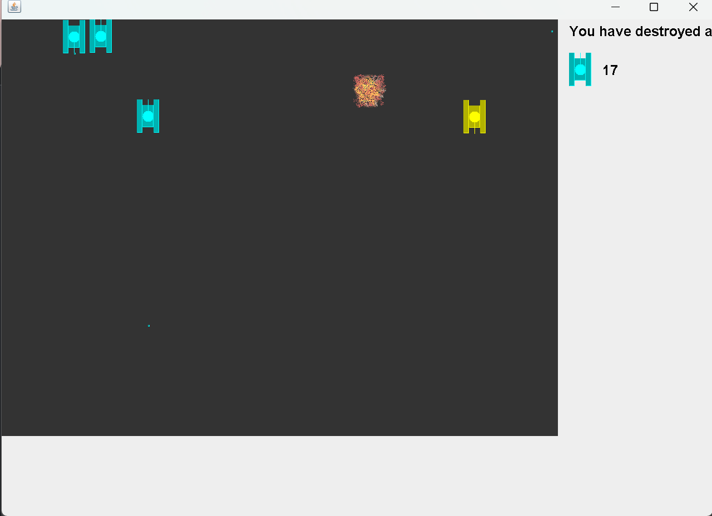

# TankGame-v1.0

# Classic Tank Battle Game in Java

> **Important Disclaimer:** The main code for this project comes from a Java course taught by renowned Bilibili instructor Shunping Han. As a student, I independently wrote, debugged, and improved the code based on the course content.
> 
> The main purpose of creating this repository is to record and demonstrate my learning process, and to fix, refactor, and expand the functionality of the code (for example, implementing the logic of unlimited troops).
> 
> All core ideas and original teaching content belong to the original author, Mr. Han Shunping. ** If you want to learn how this project was built from scratch, it is highly recommended to watch the original teaching video.

### 🌟 About The Project

This project is a recreation of the classic tank battle game. It was built from scratch to serve as a practical application for fundamental Java programming principles. The game is fully functional, featuring player controls, enemy AI, collision detection, and a save/load system.

This project demonstrates proficiency in:
* **Object-Oriented Programming (OOP):** Designing distinct classes for different game entities (`Tank`, `Hero`, `EnemyTank`, `Shot`, `Bomb`).
* **Multithreading:** Each tank and bullet runs on its own thread, allowing for independent movement and actions.
* **Java Swing for GUI:** Creating the game window, drawing all graphics, and managing the main game loop.
* **Event Handling:** Capturing and responding to keyboard inputs for player movement and actions.
* **File I/O:** Saving the game score and state to a local file, and loading it back upon request.

---

<br>

<p align="center">
  
</p>

---

### 🛠️ Built With

This project was built using the following technologies:

* **Java (JDK 8 or later)**
* **Java Swing**

---

### 🚀 Getting Started

To get a local copy up and running, follow these simple steps.

#### Prerequisites

Make sure you have the following software installed on your machine:
* **Java Development Kit (JDK)** - Version 8 or newer. ([Download here](https://www.oracle.com/java/technologies/downloads/))
* A Java **IDE** such as IntelliJ IDEA or Eclipse.

#### Running the Game

1.  **Clone the repository**
    ```sh
    git clone [https://github.com/](https://github.com/YuliaShiyy/TankGame-v1.0].git
    ```
2.  **Open the project** in your favorite Java IDE (e.g., IntelliJ IDEA, Eclipse).

3.  **Locate the main class** at the following path:
    ```
    src/GameFinal/TankGameFinal.java
    ```
4.  **Run the `main()` method** within the `TankGameFinal.java` file.

5.  Follow the instructions printed in the console to either start a **new game** or **continue** from a previous session.

---

### ✨ Features

* **🎮 Player Control:** Full control over the hero tank using `W` (up), `A` (left), `S` (down), `D` (right) for movement and `J` to shoot.
* **🤖 Enemy AI:** Enemy tanks move around the map randomly and fire bullets automatically.
* **💥 Graphics & Sound:** Features animated explosions upon impact and includes sound effects.
* **💾 Save & Load System:** The game automatically saves the score and the state of enemy tanks when you close the window. You can load this state the next time you play.
* **🔄 Infinite Gameplay:** Defeated enemy tanks will respawn, providing a continuous challenge.

---

### 🔧 My Modifications & Improvements

While following the tutorial, I implemented several modifications and bug fixes:

* **Multi-bullet Support:** Refactored the code to allow the player's tank to fire multiple bullets simultaneously.
* **Concurrency Bug Fix:** Resolved potential `ConcurrentModificationException` errors by using safe iteration techniques when handling collections of game objects.
* **Infinite Enemy Spawning:** Added a feature for new enemy tanks to spawn continuously, creating an endless gameplay mode.
* **Code Refactoring:** Organized resource files (images, sounds) into a dedicated `resources` folder for better project structure.

---
